# 🏋️‍♂️ Fitness & Health Data Analysis

This project explores the relationships between various health and fitness factors such as **height, weight, workout types, calories burned, heart rate (BPM), nutrition**.  
Each objective is supported by a visual analysis (graphs/images), followed by an insight derived from the data.

---

## 📊 Objectives & Insights

### 1️⃣ Relation Between Height and Weight

> **Insight:**  

If your height is greater, you are more likely to have a higher weight.  
*(Positive correlation between height and weight.)*

---

### 2️⃣ Which Workout Type Burns More Calories?
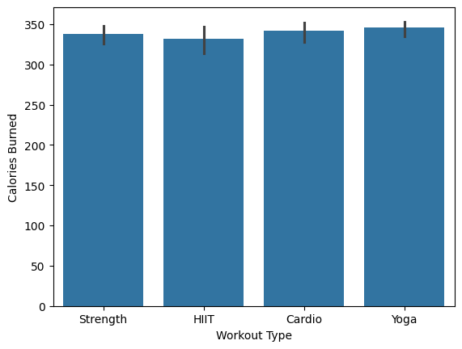

> **Insight:** 

🧘‍♀️ **Yoga** burns more calories.  
If your goal is **weight loss**, yoga may be the most effective workout type.

---

### 3️⃣ Which Workout Type Takes Less BPM?
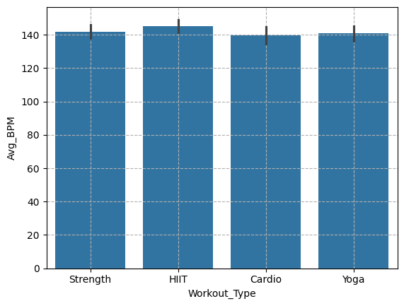

> **Insight:**  

🏃‍♂️ **Cardio** workouts have **lower average BPM** (heart rate).  
They are suitable for maintaining endurance without high heart strain.

---

### 4️⃣ Which Gender Has Higher Ratings?
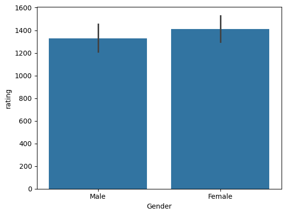

> **Insight:**  

👩 **Females** have higher average ratings compared to males.

---

### 5️⃣ Which Gender Has More Lean Mass?
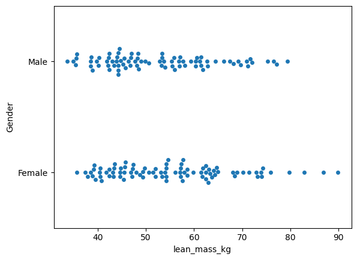

> **Insight:**  

👩 **Females** show higher lean mass on average.

---

### 6️⃣ Correlation Between Sets, Reps, Rating & Calories Burned
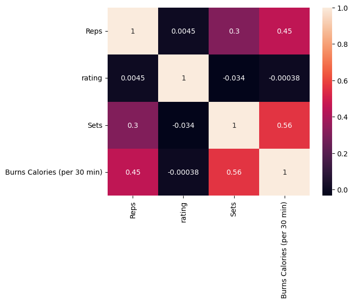

> **Insight:**  

- 🏋️‍♂️ **Sets and reps** influence calorie burn.  
- ⚖️ **No clear correlation** between rating and other metrics.

---

### 7️⃣ Cooking Method vs Preparation Time
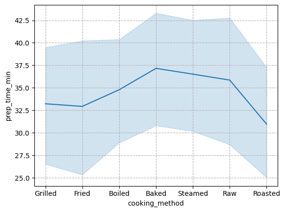

> **Insight:** 

🍳 Cooking method affects prep time.  
- **Roasted** methods are faster → ideal for busy people.  
- **Baked** methods take longer preparation time.

---

### 8️⃣ Which Exercise Has Fewer Sets?
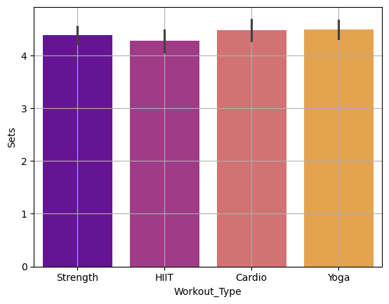

> **Insight:** 

🔥 **HIIT** (High-Intensity Interval Training) requires **fewer sets**, focusing on intensity over quantity.

---

### 9️⃣ Relation Between BPM and Workout Type
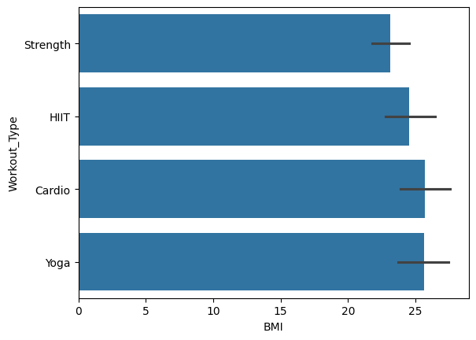

> **Insight:** 

- **HIIT** = highest BPM (intense effort)  
- **Cardio** = lower BPM (steady pace)

---

### 🔟 Relation Between Workout Type and Water Intake
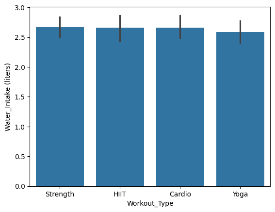

> **Insight:** 

💧 People who practice **yoga** drink less water compared to other workout types.

---

### 11️⃣ Relation Between Water Intake and Gender
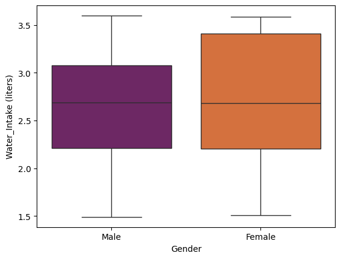

> **Insight:**  

👩 Females tend to **consume more water** than males.

---

### 12️⃣ Relation Between Fat % and Carbs
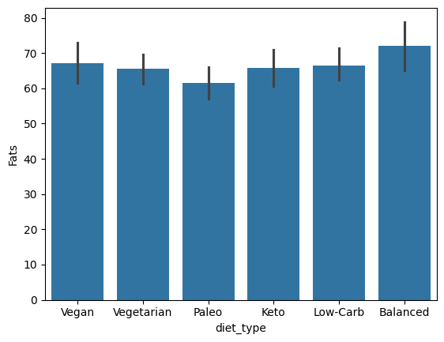

> **Insight:**  

🥗 **Paleo diet** followers consume **minimal fat**, maintaining a lean profile.

---

### 13️⃣ Relation Between Fat % and Sugar
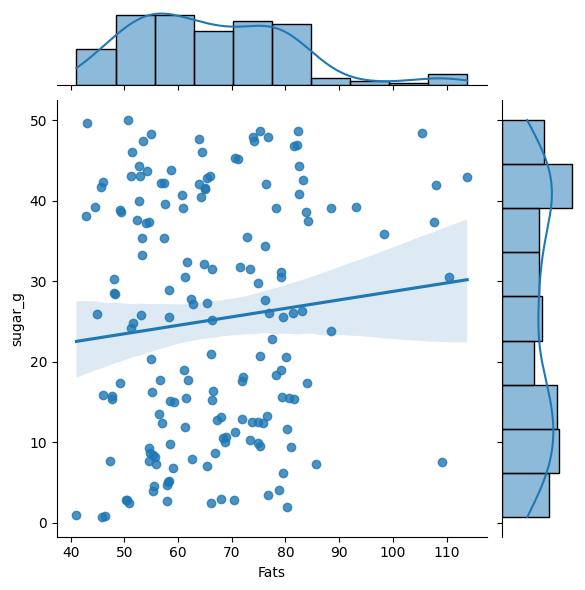

> **Insight:** 

No clear relation was found between **fat percentage** and **sugar intake**.

---

### 14️⃣ Age vs BPM

> **Insight:** 

🧍 Individuals aged **20–45 years** show **higher BPM**, indicating active metabolism and physical activity levels.

---

### 15️⃣ Age vs Fat %

> **Insight:** 

People aged **18–43** tend to have **higher body fat percentages**.

---

### 16️⃣ Workout Type vs Protein Intake

> **Insight:** 

🏃‍♀️ **Cardio** practitioners consume **less protein** compared to other workout types such as HIIT or strength training.

---

## 📘 Summary

This analysis highlights how **fitness, nutrition, and personal habits** are interrelated.  
Understanding these relationships helps design smarter **diet plans**, **training programs**, and **lifestyle improvements** for better overall health.

---

## 🧠 Tools & Libraries 

- **Python** 🐍  
- **Pandas** for data manipulation  
- **Matplotlib & Seaborn** for visualization  
- **NumPy** for numerical analysis  

---

## 💡 Author
**Shahal** — passionate about data-driven fitness insights and smart health analytics.  

---

⭐ *If you find this project insightful, consider giving it a star on GitHub!*
